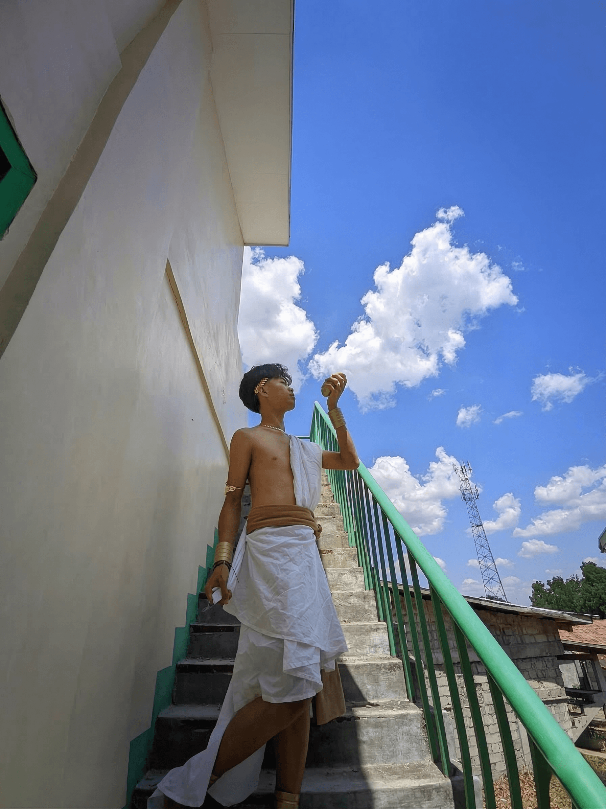

# 🌟 Zyron Neil Bautista — Personal Portfolio

> A personal portfolio website showcasing my projects, skills, and background as a CS student and creative developer.



---

## 🔗 Live Site

**[zyron-portfolio-v2](https://github.com/ZyronNeil2007/zyron-portfolio-v2)** — hosted on GitHub Pages *(or your preferred host)*

---

## ✨ Features

- **Hero Section** — Animated typewriter effect with a profile image and call-to-action buttons
- **About Section** — Bento-grid layout with an intro, skills, what I do, and fun facts
- **Projects Section** — Card-based project showcase with tech tags and links
- **Contact Section** — Simple, focused call-to-action with email link
- **Theme Toggle** — Light/Dark mode with preference persistence via `localStorage`
- **Liquid Glass Effect** — Custom SVG displacement filter for a premium glass UI
- **Scroll Reveal Animations** — Elements animate in using `IntersectionObserver`
- **Floating Tab Bar** — Mobile-friendly bottom navigation
- **Fully Responsive** — Adapts to mobile, tablet, and desktop viewports

---

## 🛠️ Tech Stack

| Layer | Technology |
|---|---|
| Structure | HTML5 (semantic) |
| Styling | Vanilla CSS (custom properties, CSS Grid, Flexbox) |
| Logic | Vanilla JavaScript (ES6+) |
| Icons | [Phosphor Icons](https://phosphoricons.com/) |
| Fonts | [Inter — Google Fonts](https://fonts.google.com/specimen/Inter) |

> No frameworks. No dependencies. No build tools. Just clean, lightweight vanilla web tech.

---

## 📁 Project Structure

```
my-portfolio/
├── index.html          # Main HTML — all sections and structure
├── style.css           # All styles, design tokens, and responsive layout
├── script.js           # Theme toggle, typewriter, scroll animations, liquid glass
├── components/         # Additional component assets (if any)
└── README.md           # This file
```

---

## 🎨 Design Highlights

- **Dark/Light Mode** with smooth CSS variable transitions
- **Bento Grid Layout** for the About section
- **Liquid Glass UI** — a custom SVG `feDisplacementMap` + `backdrop-filter` effect that simulates refraction and chromatic aberration
- **Ambient Background Glows** using fixed, blurred radial shapes
- **Micro-animations** on hover for cards, buttons, and the profile image

---

## ⚡ Performance Optimizations

- Scroll handler throttled via `requestAnimationFrame` (max 60fps)
- `passive: true` on scroll listeners for compositor-thread scrolling
- Liquid Glass SVG filters cached in a `Map` — never regenerated for the same dimensions
- `transform: translateZ(0)` on fixed/glass elements to promote GPU compositor layers
- `IntersectionObserver` for scroll-reveal (zero scroll event cost)
- `will-change` hints on animated elements

---

## 🗂️ Sections

| Section | Description |
|---|---|
| **Home** | Hero with typewriter intro and profile image |
| **About** | Who I am, what I do, technical skills, and fun facts |
| **Projects** | BNHS Online Quiz Website, School Platform, Nephricarn Business |
| **Contact** | Email CTA — *"Let's build something great."* |

---

## 🚀 Getting Started

No installation needed. Just open `index.html` in any modern browser:

```bash
# Clone the repository
git clone https://github.com/ZyronNeil2007/zyron-portfolio-v2.git

# Open in browser
cd zyron-portfolio-v2
start index.html   # Windows
open index.html    # macOS
```

---

## 📬 Contact

| Platform | Link |
|---|---|
| ✉️ Email | [zyronneilbautista10@gmail.com](mailto:zyronneilbautista10@gmail.com) |
| 📘 Facebook | [facebook.com/share/18ZFsaeo4S](https://www.facebook.com/share/18ZFsaeo4S/) |
| 📸 Instagram | [@zyronnei10](https://www.instagram.com/zyronnei10/) |
| 🎵 TikTok | [@zyron_neil](https://www.tiktok.com/@zyron_neil) |
| 🐙 GitHub | [ZyronNeil2007](https://github.com/ZyronNeil2007) |

---

## 📄 License

This project is open source and available under the [MIT License](LICENSE).

---

<p align="center">Designed & Developed by <strong>Zyron Neil Bautista</strong> © 2025</p>
